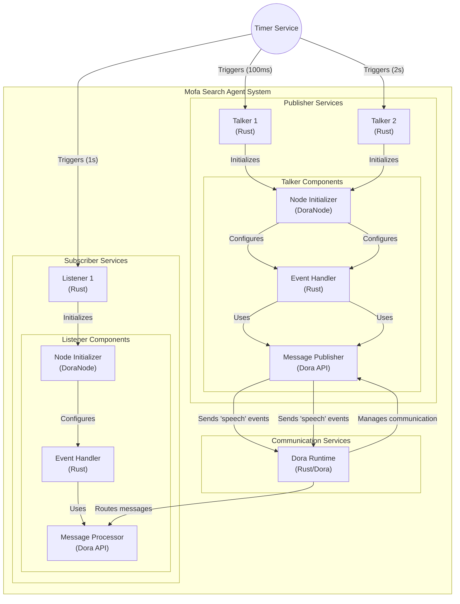
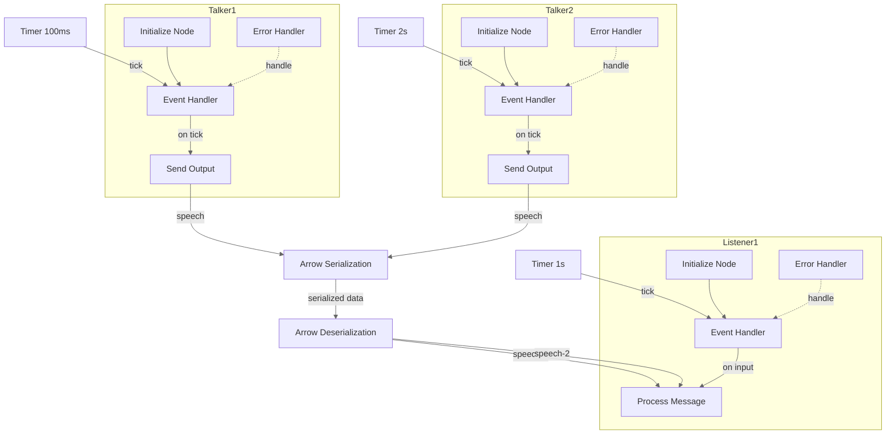

### How to Start the Project

This project is based on Rust. 

#### Prerequisites:
- Install [Rust 2024 Edition](https://www.rust-lang.org/tools/install).
  - Command: `curl --proto '=https' --tlsv1.2 -sSf https://sh.rustup.rs | sh`
- Install [Dora-cli](https://dora-rs.ai/zh-CN/).
  - Command: `cargo install dora-cli`
  - If you encounter issues, try using the `--locked` flag.

#### Verify Successful Setup:
- Ensure you have Rust 2024 Edition:
  - Check Rust version: `rustc --version`
    - Example: rustc 1.85.1 (4eb161250 2025-03-15)
  - Check Cargo version: `cargo --version`
    - Example: cargo 1.85.1 (d73d2caf9 2024-12-31)
- Check Dora-cli version:
  - Command: `dora --version`
    - Example: dora-cli 0.3.10

#### Clone the Project:
- Clone the repository:
  - Command: `git clone https://github.com/Jackylee2233/mofa_search_agent_contest.git`

#### Run the Project: (Ubuntu 24.10 tested)
1. Navigate to the project directory:
   - Command: `cd mofa_search_agent_contest`
2. Start Dora services:
   - Command: `dora up`
   - Output should display:
     - "Started dora coordinator"
     - "Started dora daemon"
   - If errors occur:
     - Run `dora destroy` before retrying `dora up`.
     - Alternatively, use `dora check` to inspect the Dora status.
3. Run the project:
   - Set the environment variable: `DORA=dora`
   - Then Run Command: `cargo run`
   
   - Full Command: `DORA=dora cargo run`
     - This command will act as a wrapper to automatically execute:
       - `dora build dataflow.yml`
       - `dora start dataflow.yml`

### How to Stop the Project

- The project runs in an infinite loop to demonstrate the Dora framework. To stop it, press `Ctrl+C` in your terminal.

*Note: Updates will be added here as the project evolves.*

### How to Debug the Project

- Debug information can be found in the `out` folder located in the root directory of `mofa_search_agent`.

### Project diagram

This is auto generated project diagram, will auto update after every commit push.

**Map the communication interfaces between talker and listensr components**

### Relating to rust-analyzer
Since the entire Dora project (`mofa_search_agent`) is placed within a single Rust project (`mofa_search_agent_contest`), the Dora project essentially functions as a Rust workspace. However, having a workspace nested within another Rust project is currently not supported by rust-analyzer for syntax hints, suggestions, and similar features.

The solution is to open the Dora project separately in another IDE window. This way, you can fully utilize the support provided by rust-analyzer.

### License

This project uses the MIT license. For more information, see the [LICENSE](LICENSE) file.
