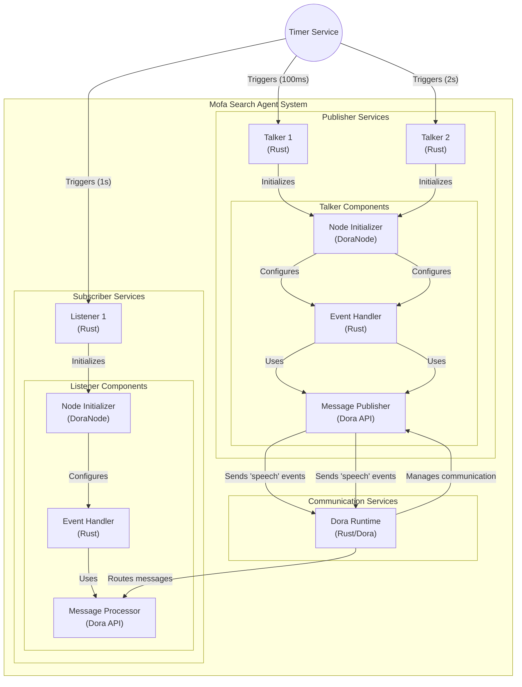
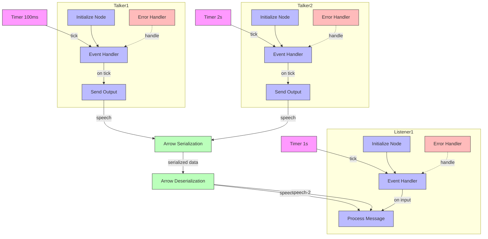

# Mofa dev notes:

- Setup Server

  * [x] Base Server rust-axum-async-graphql-postgres-redis-starter
    

      
Desc

        Use rust-axum template from GitHub.
    

  * [x] Add a new general websocket router by Cursor.
  * [x] Add an example of a websocket client by Cursor.
  * [x] Testing the connection done!

- Setup One click to dora up, dora build and dora run dataflow
  * [x] Make a new Rust project called 'dora_auto_run'
    

      
Desc

       This project automates running the mofa dora AI agent project.
       Command Run order: `cargo run <dora_auto_run>` --> `dora up` --> `dora build` --> `dora start`
    

  * [x] Test wrap basic command: `dora --version` & `dora --help` done!
  * [x] Add dora build-in tracing log to `dora_auto_run_test`; tried adding by AI, but Cursor did not perform well.
  * [x] Try manually adding the dora tracing crate. dora-tracing is an independent project of dora. Try grouping it with dora_auto_run_test into a new Rust workspace. -- Discontinued. Delete workspace.
    [x] Try using dora-node-api with the feature ["tracing"]
      1. [x] Copy the dora Rust example `rust-dataflow` to the `working` workspace.
      2. [x] Test the standalone `dora-tracing` crate. This crate only works with `dora-cli new`, or you can use dora-node-api with the feature `tracing`.
  * [x] Use `dora new` to create a new dora project called `mofa_search_agent`.
  * [x] Test one-click to run mofa_search_agent by another Rust project called `mofa_search_agent_contest` @03-26-2025 pm 16:15
      1. [x] One-click to run a `dora` project requires creating a new Rust project and wrapping the dora project. Basically, a `dora new` project is a Rust workspace. If you do this wrapping, the rust-analyzer will not work correctly inside the `dora` project. But the wrapper Rust project works well. This could issue a new function request to the `rust-analyzer` team.

      TODO: NEW CLI TOOL

      2. [x] Running a dora project requires executing `dora build` and `dora start`, so it is better to create a new layer on top of `dora-cli`. We can add more logic in this layer to help check the system environment before running the dora project.

      3. [x] Before running the dora cli wrapper, run `dora check` to make sure the dora environment of `dora Coordinator` and `dora daemon` are running, or run `dora up` if not running. This check will be included in the wrapper later in TODO; 03-26-2025 pm 18:00

      4. [x] This Wrapper is inspired by Cursor Editor's new Agent function, which helps create a brand new project inside your working directory when you are prompting to LLM by Cursor (call agent to create something in your system or project's folder). If using the `Clap` crate, it will greatly help this basic Wrapper project. Will try it later.

- More on dora cli wrapper project, to be expected:

  * The wrapper works as a super node outside the dora dataflow.
  * Works like the dora coordinator but for custom compute needs. This design can add some functionality that dora has not yet published.
  * ...TODO!  @03-26-2025 pm 20:38

- Setup moly as frontend

  * Got good news from Alex that moly has new functionality to handle network connectivity errors. Waiting for the merge and sync of the moly repo.

  * Basic idea of using `moly` frontend: `moly` has a great ability to fire inquiries to remote LLM services and locally with the help of `moly-server`. It works as a starting point for `mofa_search_agent`, using a local service for simple inquiries and using a remote LLM for complex questions.

  * TODO:
      1. Upgrade the `moly-server` to handle websocket connections. Add a websocket client to the `moly` frontend and one control `node` of the `dora` project.
      2. Interconnect `moly-server` -> `moly` -> `dora` by websocket for real-time communication.
  * Dataflow design:
      1. Input the first inquiry in `moly`, get a response as the initial dataflow, pass it to `dora` for processing in the loop of the `dora node`, and send back the result to `moly` for display.
      2. Add the ability for `moly` to intercept the `message` sent by `dora` and add a display window for the `message` from `dora`. Keep the original `chat message` in the `moly` message UI for comparison.
      3. The new `moly` message window has buttons for selection, in case of needing to fire another request to the LLM service. This window can receive and display multiple messages.
      4. Add a redis node in the dora dataflow for buffering and processing duplicate info.
      5. More ....TODO! @03-26-2025 pm 21:30

  * This project will work as a human assistant who needs help from LLMs to handle his/her daily workload. Project will `fire promts`, `mix promts`, `modify promts`, `review responts`, `compare responts` to different LLMs before you reply to your customer or your supervisor. All the options and tooling will be shown on the `moly` UI. It needs modified versions of `moly`.

### mofa Cursor prompts:
- @dataflow.yml @Cargo.toml remember: you are working on a dora-rs project. It uses Rust to develop agent nodes. This project is a workspace called `mofa_search_agent_contest`. Please help explain this workspace and the 'dataflow.yml' file!

  * Use Cursor's agent & auto mode. The Cursor IDE rejected offering free service to me due to pro users being in high demand! And asked me to upgrade to the pro version! @03-26-2025 am 11:26

  * Switch to Zed to continue my project today @03-26-2025 am 11:30

### mofa Zed prompts:
- Use dora-rs to build an automated AI Agent. The Agent will automatically execute a series of tasks based on user instructions or event triggers. Please build an efficient, flexible, and intelligent AI Agent dataflow file. Specific requirements are as follows:
  * Multiple nodes: including dynamic nodes and static nodes.
  * Conditional nodes: based on the input conditions, decide which output port to send the data to.
  * Routing nodes: based on the specific attributes or values of the input data, send the data to different output ports.

### project diagram

**1. big picture**

**2. Map the communication interfaces between talker and listener components**

