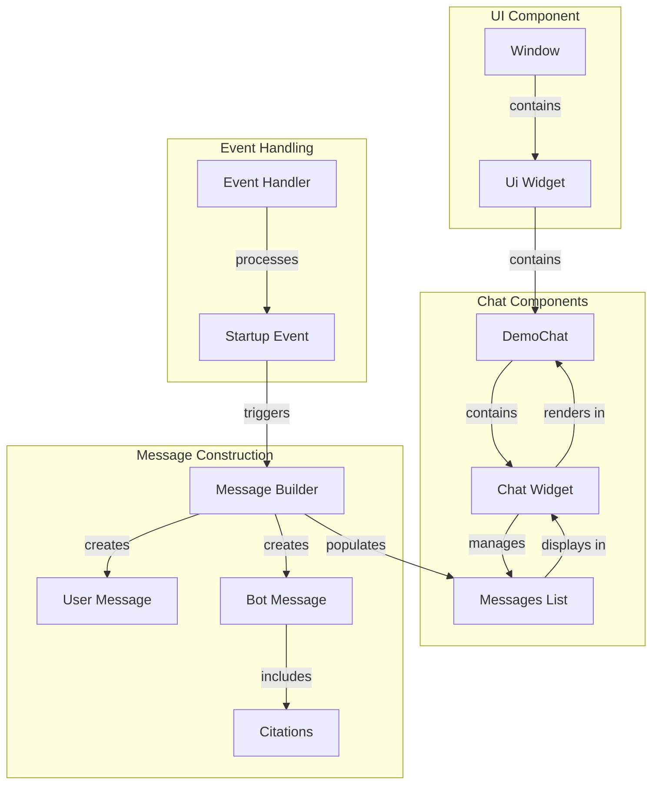

### The init mofa_frontend diagram

```mermaid
graph TB
    subgraph "UI Component"
        window["Window"]
        uiWidget["Ui Widget"]
    end

    subgraph "Event Handling"
        eventHandler["Event Handler"]
        startupEvent["Startup Event"]
    end

    subgraph "Chat Components"
        demoChat["DemoChat"]
        chatWidget["Chat Widget"]
        messagesList["Messages List"]
    end

    subgraph "Message Construction"
        messageBuilder["Message Builder"]
        userMessage["User Message"]
        botMessage["Bot Message"]
        citations["Citations"]
    end

    %% Component Hierarchy
    window -->|"contains"| uiWidget
    uiWidget -->|"contains"| demoChat
    demoChat -->|"contains"| chatWidget
    chatWidget -->|"manages"| messagesList

    %% Event Flow
    eventHandler -->|"processes"| startupEvent
    startupEvent -->|"triggers"| messageBuilder

    %% Message Creation Flow
    messageBuilder -->|"creates"| userMessage
    messageBuilder -->|"creates"| botMessage
    botMessage -->|"includes"| citations
    messageBuilder -->|"populates"| messagesList

    %% Data Flow
    messagesList -->|"displays in"| chatWidget
    chatWidget -->|"renders in"| demoChat
```